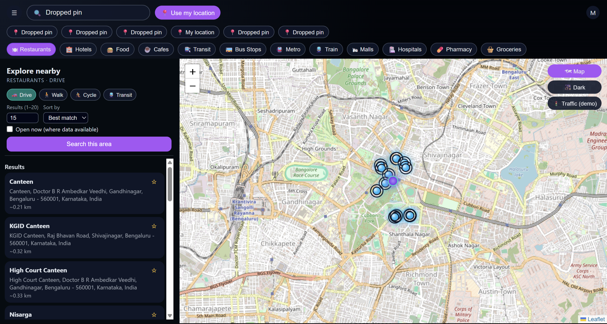
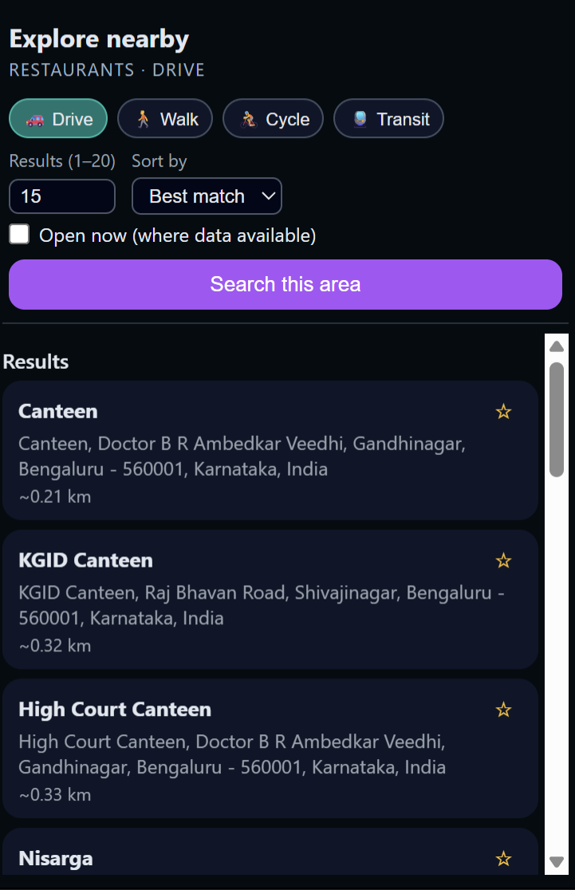
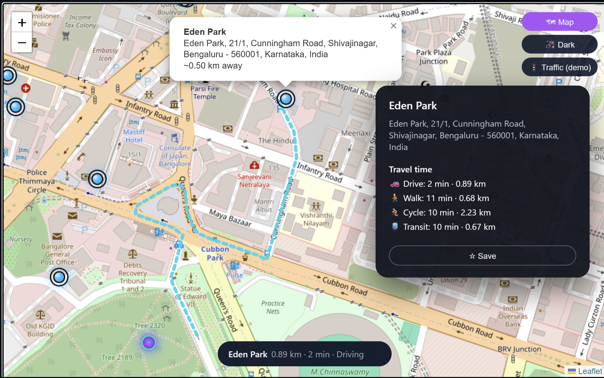
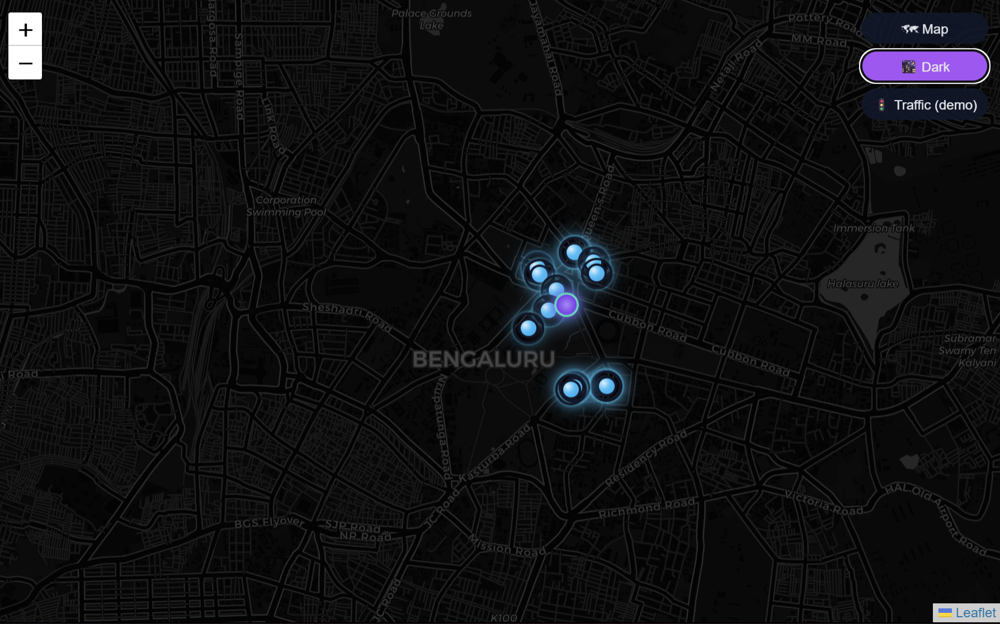

<div align="center">
  
  <h1>SmartGeo | Geo-Intelligence Recommender System</h1>
  <strong>React + FastAPI + AI-powered Maps + Real-time Routing</strong>
  <br/><br/>

[](LICENSE)
[]()
[]()
[]()

</div>

---

## 🚀 What is SmartGeo?

SmartGeo is a next-gen location intelligence platform — a mini alternative to Google Maps — offering:

- 🔍 Smart search around you (restaurants, hospitals, metro…)
- 🧭 Draggable pin search — **search anywhere instantly**
- 🚦 Real routing & travel mode comparison (Drive / Walk / Cycle / Transit)
- ⭐ Save favorites and revisit history
- 🌙 Sleek dark-mode design
- 🤖 ML-based scoring for better ranking
- 📊 Geo-analytics with heatmaps and clustering (planned)

Built for **real-world mapping roles** — perfect for portfolios, interviews & GIS/AI hiring.

---

## 🧩 Features Overview

| Feature | Status | Powered By |
|--------|--------|------------|
| Smart place recommendations | ✅ | ML Scoring + Geoapify |
| Real-time routing with ETA | ✅ | Routing API |
| Draggable map pin | ✅ | Leaflet |
| Favorites & history | ✅ | Local Indexed DB |
| Dark/Light themes | ✅ | Custom UI |
| Travel modes (Drive/Walk/Cycle/Transit) | ✅ | Distance Matrix |
| Heatmaps & analytics | 🔄 Coming | Clustering + Folium |

---

## 🖥️ Screenshots

### 🔍 Home — Explore Places Nearby


---

### ⭐ Recommendation List — Sorted Smartly with ML Scoring


---

### 🚦 Routing & Travel Mode Comparison


---

### 🌙 Beautiful Dark Mode


---

## 🛠 Tech Stack

| Layer | Technology |
|------|------------|
| UI / Frontend | React + Vite + Leaflet |
| Backend API | FastAPI (Python) |
| Maps & Data | Geoapify — Places, Routing, Matrix, Geocoding |
| ML Logic | Python weighted ranking + clustering |
| Local Data | SQLite + caching |
| CI & Quality | GitHub Actions + Pytest |

---

## 🧱 Architecture

```mermaid
flowchart LR
    User -->|Search / Click / Drag| Frontend[React + Leaflet UI]
    Frontend -->|REST API| Backend[FastAPI Server]
    Backend -->|Places / Routing / Matrix| Geoapify[(Geoapify API)]
    Backend --> ML[Ranking Engine]
    ML --> Backend
    Backend --> Cache[(Local Cache / DB)]
    Backend --> Frontend
